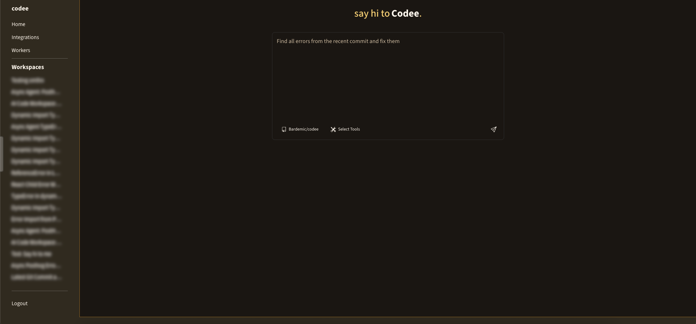
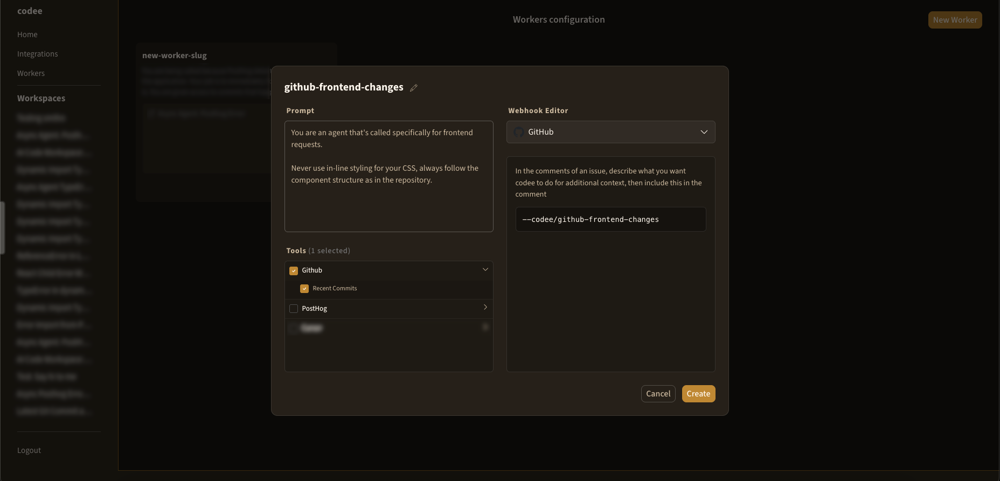

# codee, an open source asynchronous coding agent

Codee is an asynchronous coding agent which allows developers to easily run long-running tasks on their codebase in the cloud. Codee integrates with different services to allow for tool usage to access information like data analytics, as well as automatically running tasks (workers) via webhooks.



## Table of Contents

- [Workers](#workers)
- [Integrations](#integrations)
    - [Currently Supported](#currently-supported)
    - [Future Integrations](#future-integrations)
- [Install](#install)
    - [Frontend](#frontend)
    - [Backend](#backend)
    - [Worker/Orchestrator](#workerorchestrator)

## Workers

The core inspiration from Codee came from the idea that asynchronous agents aren't *really* asynchronous if someone needs to micro manage any request an agent makes, and the fact that there's typically significant amounts of power lost when the agent isn't given context further than the codebase. Most big asynchronous agents (Google's Jules, OpenAI's Codex, Cursor Cloud) don't have access to any external integrations, or if they do, none that involve being able to access relevant data that could help solve the problem.

Codee gives the flexability of creating custom "workers," which is just short for for webhook -> workspace. Users set a custom prompt, and can declare custom tools for each worker, which allows for hyper-custom workers without worrying about context bloat from tools from other integrations. Whether it's tools from an analytics service, tools to render pages and take screenshots, or other tools, workers are meant to be a more specialized and autonomous version of general coding agents.



## Integrations

### Currently supported:
- Posthog
    - Webhooks (on new error)
    - Tools (view errors, insights, analytics, documentation)
- GitHub
    - Repositories (view repositories, create branches/commits)
    - Webhooks (on issue comment)
    - Tools (commits)

### Future integrations:
- Other asynchronous agents (Cursor, Jules, etc...)
- broader webhook support (GitHub specifically)
- Slack
- more tbd


## Install

### Frontend

```
cd frontend && bun install && bun run dev
```

### Backend

```
cd backend && python -m venv venv && source venv/bin/activate && pip install -r requirements.txt && python manage.py runserver 127.0.0.1:5001
```

### Worker/Orchestrator

```
cd worker && python -m venv venv && source venv/bin/activate && pip install -r requirements.txt && celery -A celery_app worker --loglevel=info
```